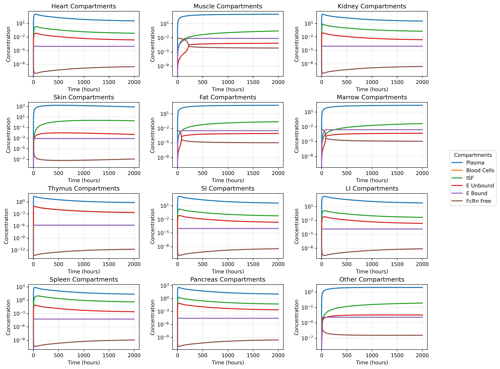
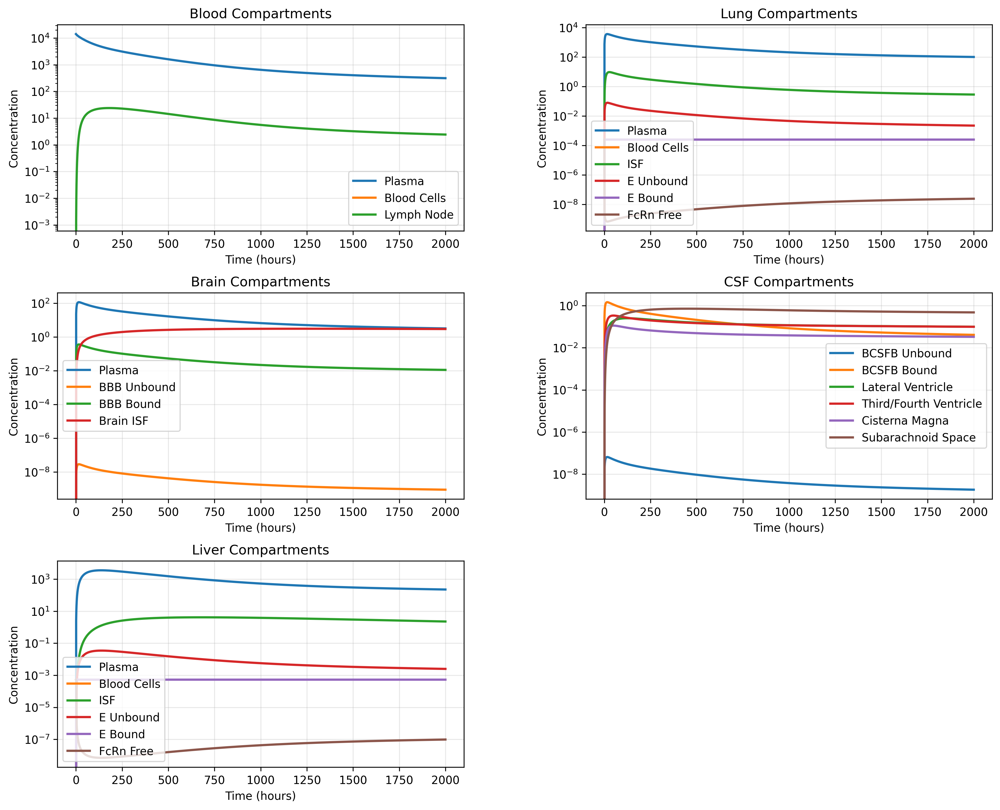

# PBPK Model Implementation (Chang et al. 2019)

This repository implements a Physiologically Based Pharmacokinetic (PBPK) model for antibody disposition in the brain, based on Chang et al. 2019. The implementation uses SBML for model definition, SBMLtoODEjax for conversion to JAX code, and Diffrax for solving the differential equations.

## Project Overview

The project offers two complementary approaches:

1. **Full Implementation** (`run_full_PBPK_model.py`)
   - Single system solution
   - Complete PBPK model
   - Simultaneous concentration updates

2. **Modular Implementation** (`run_modular_PBPK_model.py`)
   - Separate organ modules
   - Composed into unified model
   - Increased ability to add new organs / features to the model without changing the core code

## Installation and Setup

1. Clone the repository:
```bash
git clone https://github.com/DylanEsguerra/PBPK_SBML_JAX.git
cd PBPK_SBML_JAX
```

2. Create and activate a virtual environment:
```bash
# For Windows
python -m venv venv
venv\Scripts\activate

# For macOS/Linux
python3 -m venv venv
source venv/bin/activate
```

3. Install required dependencies:
```bash
pip install -r requirements.txt
```

## Usage

1. Ensure your virtual environment is activated:
```bash
# For Windows
venv\Scripts\activate

# For macOS/Linux
source venv/bin/activate
```

2. Run either implementation:
```bash
# For the full model
python src/run_full_PBPK_model.py

# For the modular implementation
python src/run_modular_PBPK_model.py
```

## File Structure and Functions

### Parameter loading
- `create_all_parameters.py`: Creates the parameter CSV file
- `parameters/pbpk_parameters.csv`: Parameter values for the model


### Full Implementation Files
- `src/run_full_PBPK_model.py`: Full model solver
  - Generates JAX model from SBML
  - Sets up and runs the ODE solver
  - Handles result plotting

- `src/models/PBPK_full_SBML.py`: SBML model generator
  - Creates compartments for all organs in one SBML file
  - Defines species and their initial conditions
  - Implements all ODEs and rate rules
  - Validates model structure

### Modular Implementation Files
- `src/run_modular_PBPK_model.py`: Modular solver
  - Coordinates the Modular model simulation

- `src/models/PBPK_modular_SBML.py`: Modular model generator
  - Combines individual organ models from seperate SBML files into a single unified model

- `src/models/organ_SBML.py`: Individual organ models
  - Creates individual organ models in seperate SBML files

## Generated Files
- `generated/sbml/`: SBML model definitions
  - `pbpk_model.xml`: Full model
  - `master_sbml.xml`: Composed modular model
  - `[organ]_sbml.xml`: Individual organ models
- `generated/jax/`: Generated JAX code
  - Used by solvers for numerical integration

## Dependencies
- JAX: Automatic differentiation and numerical computing
- Diffrax: ODE solver
- libSBML: SBML model handling
- SBMLtoODEjax: SBML to JAX conversion
- Matplotlib: Result visualization
- Pandas: Parameter data handling

## Generated Plots

Both implementations generate two visualization plots:

### 1. Typical Tissues Plot


### 2. Non-Typical Compartments Plot


## References
Chang HY, Wu S, Meno-Tetang G, Shah DK. A translational platform PBPK model for antibody disposition in the brain. J Pharmacokinet Pharmacodyn. 2019 Aug;46(4):319-338.


